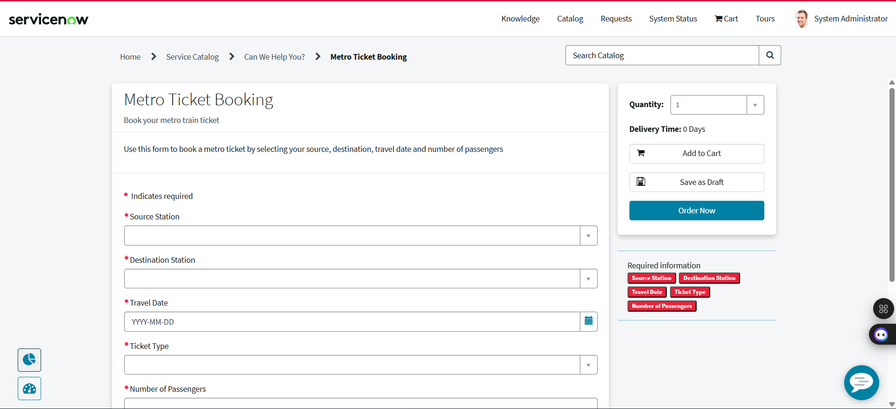

# Metro Ticket Generating System — ServiceNow

A metro ticket booking and approval system built on ServiceNow.

## Features
- Service Portal booking form for metro tickets
- Automated approval workflow using Flow Designer
- Custom tables for stations, routes, fares, and ticket types
- Email notifications on approval/rejection

## Tech Stack
- Platform: ServiceNow (PDI)
- Automation: Flow Designer
- Frontend: Service Portal
- Tables: 5 custom tables

## Screenshots
### Booking Form

### Request Approved

### Flow Designer

## How It Works
1. User submits a metro ticket booking via the Service Portal
2. Request triggers the approval flow automatically
3. Approver receives notification and approves/rejects
4. User gets email confirmation with ticket details

## Demo Video
[Watch Demo]([demo/demo-video-link.txt](https://drive.google.com/file/d/16I6kjEqqwknYPI7QkMIb7A2B7GBt5lo3/view?usp=sharing))
